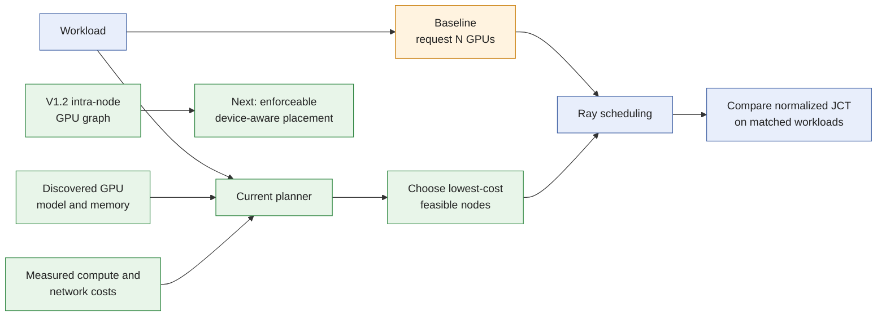

# Topology and Workload Aware GPU Scheduling

See [current implementation, validation status, and versions](docs/current-status.md)
for the shared support summary and evidence boundaries.

Research on GPU scheduling for distributed large language model (LLM) inference across heterogeneous GPU clusters using **Ray**, **KAI Scheduler** and **NVIDIA Dynamo**.

## Overview

This research aims to develop topology- and workload-aware GPU scheduling strategies that improve cluster utilization and reduce job completion time. It evaluates distributed LLM inference scheduling across heterogeneous GPU clusters using **normalized Job Completion Time (JCT)**.

## Research Focus

- **Topology-aware scheduling:** Account for cluster topology when making GPU placement and scheduling decisions.
- **Workload-aware scheduling:** Incorporate inference workload characteristics into scheduling strategies.
- **Heterogeneous GPU clusters:** Study scheduling across clusters containing GPUs with different capabilities.
- **Distributed LLM inference:** Explore scheduling strategies using Ray and NVIDIA Dynamo.

## Objectives

1. Improve GPU cluster utilization.
2. Reduce job completion time for distributed LLM inference workloads.
3. Evaluate scheduling strategies using normalized JCT.

## How This Approach Differs

The baseline requests only a GPU count. Our policy also considers discovered
hardware, workload measurements, and communication cost before asking Ray to
reserve the selected nodes.



*Conceptual design, not measured results. V1.2 records intra-node GPU
relationships, while the current policy still uses supplied workload and
inter-node network measurements. It does not predict production JCT.*

| | GPU-count baseline | Current policy |
| --- | --- | --- |
| Inputs | Requested GPU count | GPU inventory, workload profile, and link costs |
| Decision | Ray selects a feasible placement | Planner selects nodes; Ray reserves and executes |
| Objective | Satisfy the resource request | Minimize the planner's estimated compute + communication cost |

Ray already supports accelerator constraints and custom resources. This research
adds a workload-specific policy for choosing among feasible placements; Ray
still performs resource accounting and task execution. See [Ray accelerator
support](https://docs.ray.io/en/latest/ray-core/scheduling/accelerators.html).

See **[V1.1 workflow](docs/v1.1-workflow.md)** for the full order from cluster
startup and GPU discovery through planning, reservation, execution, and cleanup.
The **[V1.2 topology guide](docs/v1.2-topology-discovery.md)** explains the new
GPU relationship graph and its current enforcement boundary.

## Evaluation

Normalized JCT is the stated evaluation metric. The exact normalization baseline, job boundaries, aggregation method, hardware configurations, and workload definitions will be documented with the experiment artifacts to support reproducible comparisons.

## Repository Status

This repository includes an initial Python placement policy, automatic
intra-node GPU topology discovery, opt-in inter-node TCP link measurement, a Ray
execution adapter, and a KAI Scheduler lifecycle adapter. It is an experimental
foundation: real GPU benchmarks, workload traces, NIC inventory and GPU-to-NIC
affinity, and a physical multi-node link measurement are not yet included. The
[Dynamo lifecycle adapter](docs/dynamo-lifecycle.md) has CPU/fake-engine coverage;
real Dynamo/CUDA inference remains unverified.

See the **[changelog](CHANGELOG.md)** for version differences, improvements,
and known limitations. See **[Contributing](CONTRIBUTING.md)** to report issues,
propose scheduler changes, run validation, and prepare a pull request. See the
**[release process](docs/releasing.md)** for how a version number, changelog
section, annotated tag, and GitHub Release are produced.

The **[project roadmap](docs/roadmap.md)** defines Topology Discovery, Dynamo
Integration, Evaluation, and Next Release milestones, their dependencies, and
evidence required for completion. Track live assignments and progress in
[GitHub milestones](https://github.com/LawrenceL05/topology-aware-gpu-scheduling/milestones).

## Ray Source and Runnable Integration

- **[Complete Ray source code](https://github.com/ray-project/ray)** and **[the pinned Ray 2.55.0 source tree](https://github.com/ray-project/ray/tree/ray-2.55.0)**.
- **[Ray integration and source guide](docs/ray-integration.md)**: explains the relevant Python and C++ components, our cost model, setup, and limitations.
- **[Placement policy](topology_scheduler/policy.py)**: selects nodes using per-workload compute estimates, GPU memory/capacity and inter-node communication costs.
- **[Ray adapter](topology_scheduler/ray_backend.py)**: atomically reserves bundles on those nodes, launches one task per GPU and releases resources on completion or failure.
- **[V1.2 GPU inventory](topology_scheduler/inventory.py)**: probes every live GPU node and reads GPU identity plus pairwise PCI/NUMA ancestry and direct NVLink counts through Ray's bundled NVIDIA NVML support.
- **[V1 Dynamo contract](docs/dynamo-v1-contract.md)**: pins the Ray, Dynamo, vLLM, Python, CUDA, driver, Linux, model, ownership, readiness, and shutdown contract for independent single-GPU replicas.
- **[Inter-node link measurement](docs/link-measurement.md)**: opt-in TCP throughput and latency probes between Ray nodes, normalized into planner bandwidth with each value's source recorded.

```bash
python -m pip install -e '.[ray]'
python -m examples.plan
python -m unittest discover -s tests -v
python -m examples.ray_smoke
```

The smoke example runs real Ray with simulated logical GPUs; it performs no CUDA work. The planner example uses synthetic inputs, not experimental results. See the guide for real-cluster setup and the distinction between node placement and physical GPU topology.

Five deterministic **[reference baseline policies](docs/baseline-policies.md)**
now support controlled comparisons through one planner interface and the same
Ray execution path. Run `python -m examples.compare_policies` to inspect their
machine-readable decisions on synthetic inputs.

The **[KAI Scheduler integration](docs/kai-integration.md)** maps the same
backend-neutral plan to an external KAI PodGroup and node-pinned GPU Pods. It
reads Nodes, Queues, GPU capacity, and RBAC from Kubernetes; then submits,
watches, cancels, and cleans up the workload. Run `python -m
examples.kai_manifest` to inspect objects without a cluster or `python -m
examples.kai_submit --help` for the live-cluster path.

On a running NVIDIA GPU cluster, V1.2 constructs planner node inputs without
manually entering GPU models, counts or memory:

```python
import ray
from topology_scheduler import Workload, choose_placement, discover_planner_nodes

ray.init(address="auto")
nodes = discover_planner_nodes()
plan = choose_placement(nodes, Workload(2, 40, {"H100": 10}), {})
```

The workload profile remains an explicit experimental input, not a GPU hardware
fact. Inter-node bandwidth is supplied as well, unless a controlled
[link measurement](docs/link-measurement.md) run produces it. Run
`python -m examples.ray_inventory` to print the detected hardware and
intra-node graph. Each GPU node must advertise exactly one
`topology_node:<name>` custom resource. The current Ray adapter reserves a node
but cannot select a particular physical GPU pair from this graph.
