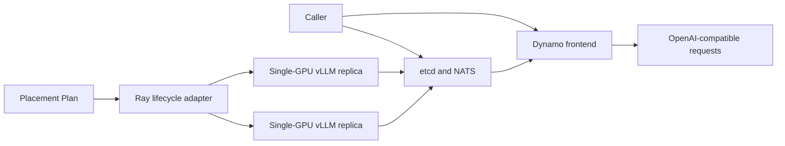

# V1 Ray, Dynamo, and vLLM integration contract

See [current implementation, validation status, and versions](current-status.md)
for the shared support summary and evidence boundaries.

This document fixes the architecture and runtime for the first Dynamo
milestone. The [worker lifecycle adapter](dynamo-lifecycle.md) is implemented
with CPU/fake-engine coverage; real Dynamo/GPU serving remains unverified.
V1 uses Ray to reserve GPUs and own long-lived worker processes,
Dynamo to register and route serving endpoints, and vLLM to execute the model.
It preserves the existing planner and finite-task adapter.

## Pinned runtime

| Component | V1 pin |
| --- | --- |
| NVIDIA Dynamo | 1.4.2, commit `2ecbdfdf192c69c02c6d21e931d20d3b4a0bb64a` |
| Dynamo vLLM image | `nvcr.io/nvidia/ai-dynamo/vllm-runtime:1.4.2@sha256:b23ce9e87c413725024ddfd2e06c1e7da220eb48f8a93037f0b01d564b54bd13` |
| Linux/amd64 image manifest | `sha256:d95e97babe5a4893a66fb5e4a810de78335ca6873e85e31d337e915d5ae92b5d` |
| vLLM | 0.26.0 |
| NIXL | 1.3.2 |
| Ray | 2.55.0 |
| Python | 3.12 |
| CUDA toolkit in image | 13.0.2 |
| Minimum host driver | 580.00.03 |
| Host | Ubuntu 24.04 LTS, linux/amd64, supported NVIDIA GPU |

The pin uses the latest stable Dynamo patch available when this contract was
written. NVIDIA lists Dynamo 1.4.2 with vLLM 0.26.0, NIXL 1.3.2, CUDA 13.0,
and a 580-series minimum driver. The published runtime image supplies Python
3.12 and CUDA 13.0.2.

Dynamo 1.4.2 declares `ray>=2.55.0` in its vLLM extra. The repository therefore
upgrades its exact Ray pin from 2.49.0 to 2.55.0. The existing planner,
inventory, mocked adapter, and Ray smoke tests are the required regression gate.
All Ray nodes and the driver must use the same 2.55.0 version.

The machine-readable copy is
[`deploy/dynamo-v1/contract.json`](../deploy/dynamo-v1/contract.json), and the
derived-image recipe is in
[`deploy/dynamo-v1/`](../deploy/dynamo-v1/README.md).

## Validation status

On 2026-09-15, `docker buildx imagetools inspect` resolved the pinned tag to the
recorded image-index and Linux/amd64 digests. The project test environment was
upgraded to Ray 2.55.0, then the unit suite, planner example, and both Ray smoke
examples passed. The contract tests also ensure the JSON, project dependency,
container requirement, and Docker base image stay synchronized.

The 10 GB Dynamo image has not been pulled and no NVIDIA GPU inference run has
been performed for this contract. Image build and real-GPU service evidence
belong to [issue #3](https://github.com/LawrenceL05/topology-aware-gpu-scheduling/issues/3);
this milestone does not present them as completed.

## Deployment shape



The initial model is `Qwen/Qwen3-0.6B` at revision
`c1899de289a04d12100db370d81485cdf75e47ca`. It is small enough for the first
single-GPU smoke test. V1 starts two independent replicas with tensor
parallelism set to one, a 4,096-token maximum model length, and vLLM GPU memory
utilization of 0.80. The remaining 20 percent is startup and runtime headroom;
it is a configured margin rather than a guarantee against every out-of-memory
condition.

The service namespace is `topology-scheduler-v1`. The frontend listens on
`0.0.0.0:8000`. Discovery uses etcd at `http://127.0.0.1:2379`; request and
event messaging use NATS at `nats://127.0.0.1:4222`. Deployments may replace
the loopback hosts, but the frontend and every worker in one run must receive
the same namespace and endpoints.

Worker system ports start at 18081 and increase by replica index. Startup has a
600-second deadline and graceful shutdown has a 30-second deadline. Each Ray
actor writes the child process's stdout and stderr to a file identified by the
deployment ID and replica index.

## Ownership

The caller starts and monitors etcd, NATS, and one Dynamo frontend before asking
the adapter to create replicas. The caller also supplies model credentials at
runtime when needed. These shared services survive an individual placement
attempt.

The new adapter in [issue #2](https://github.com/LawrenceL05/topology-aware-gpu-scheduling/issues/2)
owns the Ray placement group, one long-lived Ray actor per replica, each actor's guarded `dynamo.vllm` process, and the worker log
files. It must never stop caller-owned infrastructure or the frontend.

Workers register with Dynamo using the shared namespace, discovery backend, and
message endpoints. Normal shutdown sends the worker process `SIGTERM`, waits up
to 30 seconds for unregister and exit, then uses `SIGKILL` only for a process
that did not exit. The adapter then removes the Ray placement group.

## Release-specific commands

The caller-owned frontend uses Dynamo 1.4.2's module and runtime flags:

```bash
export DYN_NAMESPACE=topology-scheduler-v1
export ETCD_ENDPOINTS=http://127.0.0.1:2379
export NATS_SERVER=nats://127.0.0.1:4222
export DYN_LOG=info

python3 -m dynamo.frontend \
  --http-host 0.0.0.0 \
  --http-port 8000 \
  --discovery-backend etcd \
  --request-plane nats \
  --event-plane nats
```

For each Plan entry, the Ray-owned actor runs the equivalent of:

```bash
# Ray sets CUDA_VISIBLE_DEVICES before the actor starts.
test -n "${CUDA_VISIBLE_DEVICES:?Ray did not assign a GPU}"
export DYN_SYSTEM_PORT=$((18081 + REPLICA_INDEX))

python3 -m dynamo.vllm \
  --namespace topology-scheduler-v1 \
  --discovery-backend etcd \
  --request-plane nats \
  --event-plane nats \
  --model Qwen/Qwen3-0.6B \
  --revision c1899de289a04d12100db370d81485cdf75e47ca \
  --served-model-name Qwen/Qwen3-0.6B \
  --tensor-parallel-size 1 \
  --max-model-len 4096 \
  --gpu-memory-utilization 0.80
```

The actor validates that Ray exposed exactly one GPU and passes the existing
`CUDA_VISIBLE_DEVICES` value to the child unchanged. A device choice is never
accepted as user input.

## Plan mapping and scoring

Each entry in `Plan.workers` creates one independent replica and consumes one Ray
placement-group bundle with one CPU, one GPU, and that node's
`topology_node:<name>` marker. Repeated node names create separate replicas on
the same node. Replica index supplies stable result, port, and log naming.

A replica is a complete vLLM server, not a tensor-parallel rank. Replicas do not
exchange model activations or KV cache in V1, so the workload passed to the
current planner must set `cross_node_gb_per_pair=0`. Adding artificial
inter-replica traffic would penalize valid placements.

The current equal-rank score is also not a replica-throughput or serving-JCT
model. Its compute values must come from a matching single-replica measurement,
and `Plan.estimated_seconds` must be described only as a placement score. Claims
about throughput, latency, or JCT require measured requests against the ready
service.

## Readiness and rollback

Process creation is not readiness. A deployment becomes ready only when all of
these checks pass before the 600-second deadline:

1. every Ray actor and `dynamo.vllm` child process remains alive;
2. every replica's local system-port `/health` endpoint succeeds after model
   loading;
3. the frontend `/v1/models` response contains the pinned served model;
4. a one-token request to `/v1/chat/completions` returns a successful completion.

If any replica fails or the deadline expires, the adapter stops every replica
started by that attempt, applies the shutdown deadline, removes the placement
group, and reports the failed replica with its log path. It must not leave a
smaller service running and call it successful.

During normal shutdown, the caller first stops sending new requests. The
adapter stops and unregisters workers, then releases Ray resources. The caller
stops the frontend, NATS, and etcd only after no other deployment uses them.

## Explicitly deferred

V1 does not support tensor or pipeline parallel groups, rank rendezvous,
multi-GPU replicas, disaggregated prefill/decode, KV transfer, KV-aware routing,
autoscaling, or automatic frontend/infrastructure ownership. Those features
need new planner units, group-level readiness, failure handling, and measured
cost inputs before they can be advertised.

## Primary sources

- [Dynamo 1.4.2 compatibility matrix](https://docs.nvidia.com/dynamo/v1.4.2/reference/compatibility)
- [Dynamo 1.4.2 release artifacts](https://docs.nvidia.com/dynamo/v1.4.2/reference/release-artifacts)
- [Dynamo 1.4.2 local installation requirements](https://docs.nvidia.com/dynamo/v1.4.2/cli/installation/install-dynamo)
- [Dynamo 1.4.2 deployment guide](https://docs.nvidia.com/dynamo/v1.4.2/cli/model-deployment/introduction)
- [Dynamo 1.4.2 frontend configuration](https://docs.nvidia.com/dynamo/v1.4.2/reference/components/frontend-configuration)
- [Dynamo 1.4.2 vLLM configuration](https://docs.nvidia.com/dynamo/v1.4.2/reference/backends/v-llm-configuration)
- [Dynamo 1.4.2 dependency declaration](https://github.com/ai-dynamo/dynamo/blob/v1.4.2/pyproject.toml)
- [Ray 2.55.0 release](https://github.com/ray-project/ray/releases/tag/ray-2.55.0)
- [Pinned Qwen model revision](https://huggingface.co/Qwen/Qwen3-0.6B/tree/c1899de289a04d12100db370d81485cdf75e47ca)

The adapter also forces PP=1, DP=1, aggregated mode, and the local `mp` executor.
See the [lifecycle guide](dynamo-lifecycle.md) for configurable replica CPUs,
frontend preflight, isolated names, Linux process containment, and retained
reservations when cleanup cannot be verified. These are implementation details
of the pinned contract, not evidence of a real-GPU run.
