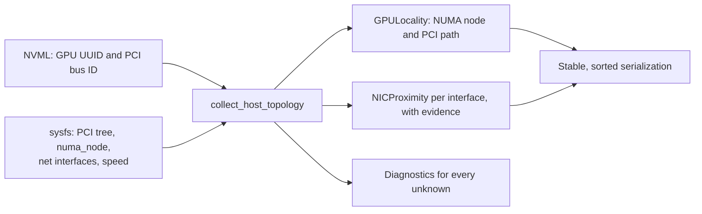

# GPU, NUMA, and NIC host locality

See [current implementation, validation status, and versions](current-status.md)
for the shared support summary and evidence boundaries.

[V1.2 discovery](v1.2-topology-discovery.md) records how GPUs relate to each
other inside a node. This collector answers the host-side question next to it:
which CPU NUMA domain owns each GPU, and which network interface sits closest
to it. [host_topology.py](../topology_scheduler/host_topology.py) reads that
from the kernel, so no one types a GPU, NUMA, NIC, or PCI mapping by hand.

Everything here is an observation. Proximity does not promise bandwidth, and
nothing in this module binds a GPU or a NIC to a workload.



## What is read

| Source | Used for |
| --- | --- |
| `/sys/devices/pci*/**` | The PCI hierarchy, walked by directory name so each function's ancestry is known |
| `<pci device>/numa_node` | The NUMA node of a GPU or a NIC |
| `/sys/devices/**/net/*` | Interfaces attached to a PCI function |
| `/sys/devices/virtual/net/*` | Virtual interfaces such as loopback and bridges |
| `<interface>/speed`, `<interface>/operstate` | Advertised Mbit/s and link state |

GPU identity still comes from NVML through the existing V1.2 probe: the UUID
and PCI bus ID are the stable identifiers, and NVML's eight-digit domain is
normalized to the four-digit sysfs form by `normalize_pci_address()`.

Reads go through `SysfsReader`, which is the only part that touches a
filesystem. Fixtures subclass it, so the classification logic is tested without
a host, a GPU, or root access.

## How proximity is decided

For each GPU and interface, the first rule that matches wins:

| Proximity | Rule |
| --- | --- |
| `same-device` | The two functions share a PCI device, differing only in function number |
| `same-switch` | Their PCI ancestors share at least one bridge below the host bridge |
| `same-root-complex` | They share only the host bridge |
| `same-numa` | No shared PCI ancestor, and both NUMA nodes are known and equal |
| `cross-numa` | No shared PCI ancestor, and both NUMA nodes are known and differ |
| `unknown` | Anything else, always with a reason |

Each result keeps the evidence behind it: the deepest shared PCI ancestor, both
NUMA nodes, and a reason when the answer is `unknown`. A GPU's `nearest_nic` is
the first interface in that order, or `None` when nothing could be related.

## Unknown states and fallbacks

Nothing is guessed, and nothing is dropped. Every interface stays in the
result, and every gap adds a diagnostic naming the GPU or interface:

| Situation | Result |
| --- | --- |
| `numa_node` holds `-1` | NUMA node is `None`; the kernel does not know |
| `numa_node` is absent | NUMA node is `None`, reported as `missing` |
| `numa_node` cannot be read | NUMA node is `None`, reported as `unreadable`, with the error type |
| The GPU's PCI address is not under `/sys/devices` | The GPU is kept with an empty PCI path and every interface is `unknown` |
| An interface has no PCI device | It is kept, marked `virtual`, and classified `unknown` |
| `speed` is `-1` or unreadable | `speed_mbps` is `None` |
| No interfaces exist at all | A diagnostic says so, and the GPU list is still returned |

## Stable identity and ordering

Repeated discovery on an unchanged host produces identical output: GPUs are
sorted by PCI address, interfaces by name, and each GPU's interfaces by
proximity and then name. `as_dict()` contains only plain types, so a report can
be compared or stored directly.

## Run it

```bash
python -m examples.host_topology
python -m examples.host_topology --host
python -m examples.host_topology --live
```

The default prints a synthetic two-socket host, so the output is deterministic
and needs no GPU; it is the version CI runs. `--host` reads this machine's
sysfs and supplies no GPUs, which is a quick way to see the interfaces a real
host reports. `--live` connects to a running Ray cluster and maps every GPU
node through `discover_host_topology()`, which pins one probe per node:

```python
import ray
from topology_scheduler import discover_host_topology

ray.init(address="auto")
for topology in discover_host_topology():
    for gpu in topology.gpus:
        print(topology.node_name, gpu.uuid, gpu.numa_node,
              gpu.nearest_nic.nic_name if gpu.nearest_nic else None)
```

## Confidence limits

- Proximity is structural. A NIC on the same switch is not necessarily faster
  in practice; only a measurement says that, and none is implied here.
- Nothing binds a GPU to a NIC. Ray, KAI, and the driver still choose devices,
  and this module does not change placement or its cost function.
- sysfs is Linux-only. On other platforms the collector returns no PCI devices
  and no interfaces, with diagnostics rather than errors.
- Virtualized and containerized hosts often hide the PCI tree or report no NUMA
  node. Those cases stay `unknown`; they are not approximated.
- Interface fields here are deliberately small.
  [NIC inventory #14](https://github.com/LawrenceL05/topology-aware-gpu-scheduling/issues/14)
  is expected to supply richer identity, state, and advertised speed, and can
  replace this collector's interface reads without changing the classification.
- These observations are not yet a typed graph;
  [affinity graph #16](https://github.com/LawrenceL05/topology-aware-gpu-scheduling/issues/16)
  is where placement policies would consume them.
- No physical multi-socket GPU host has been mapped yet. The rules are covered
  by fixtures, and CI additionally runs the real reader against a Linux host
  that has interfaces but no GPU.
