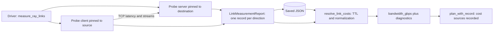

# Inter-node link measurement

See [current implementation, validation status, and versions](current-status.md)
for the shared support summary and evidence boundaries.

The planner charges cross-node traffic against a bandwidth map that callers
have so far typed in by hand. [links.py](../topology_scheduler/links.py) adds an
opt-in way to measure that map instead: it probes directional TCP throughput
and round-trip latency between live Ray nodes, keeps every direction as raw
evidence, and normalizes fresh, successful results into the planner's
undirected map with each value labelled by where it came from.

A measurement is time-scoped experimental evidence, not a hardware fact. TCP
results are not RDMA, GPUDirect RDMA, NCCL, or application throughput.



## What a probe measures

For each ordered pair of selected nodes, a server actor starts on the
destination and listens on that node's Ray address (`NodeManagerAddress`). A
client task on the source then runs two phases:

- **Latency.** One connection with Nagle disabled sends `latency_samples`
  8-byte messages that the server echoes. The record keeps the median as
  `rtt_seconds` and the minimum as `rtt_min_seconds`. This includes both TCP
  stacks; it is not an ICMP ping.
- **Throughput.** `streams` parallel connections each write `chunk_bytes` at a
  time. The receiver starts a window `warmup_seconds` after each stream's first
  byte and counts what arrives in the next `duration_seconds`. The sender keeps
  writing for 0.25 s past the window so that path delay cannot leave its end
  empty. `throughput_bytes_per_second` is the sum over streams.

Counting at the receiver avoids crediting bytes that were only buffered by the
sender's kernel.

| Parameter | Default | Bound |
| --- | --- | --- |
| `duration_seconds` | 5 | at most 60 |
| `warmup_seconds` | 1 | nonnegative |
| `chunk_bytes` | 1 MiB | 1 to 16 MiB |
| `streams` | 1 | 1 to 8 |
| `latency_samples` | 20 | 1 to 1000 |
| `timeout_seconds` | 30 | must exceed `warmup_seconds + duration_seconds + 1` |
| `max_concurrent_pairs` | 1 | 1 to 4 |

## Safeguards against accidental load

- Nothing runs during planning. `measure_ray_links()` is the only entry point
  that sends traffic, and it refuses to start unless called with
  `allow_network_load=True` exactly.
- The bounds above are enforced by `ProbeParameters`, so a configuration cannot
  become a long or wide load test.
- Directions run one at a time by default. With `max_concurrent_pairs` above
  one, a batch never contains two directions that share a node, so probes do
  not compete for the same NIC.
- A server accepts only the connections one probe needs and stops within twice
  `timeout_seconds`. After each batch, unfinished clients are cancelled and
  every server actor is killed.
- Probe tasks request no CPUs so that they are not queued behind a workload.
  That also means they can run beside one: measure in a controlled window.

## The measurement record

Each `LinkMeasurement` describes one direction:

| Field | Meaning |
| --- | --- |
| `direction` | `source->destination` topology names |
| `source`, `destination` | Topology name, Ray node ID, IP address, interface, advertised Mbit/s |
| `status` | `succeeded`, `failed`, `timed_out`, or `unreachable` |
| `started_at`, `finished_at` | Unix epoch seconds (UTC); also `started_at_utc` as ISO 8601 |
| `parameters` | The complete `ProbeParameters` used |
| `throughput_bytes_per_second`, `rtt_seconds`, `rtt_min_seconds` | Results; `null` unless `succeeded` |
| `error`, `hint` | What failed, and what to check next |
| `software` | Python, platform, Ray, and package versions on the source node, or on the driver when the probe never started |
| `units` | The unit of every numeric field |

The source address is the one the kernel routes from toward the destination.
On Linux, each endpoint's interface is the one whose primary IPv4 address
matches, and `advertised_mbps` is read from `/sys/class/net/<interface>/speed`.
On other platforms, for IPv6 addresses, and for virtual interfaces without a
reported speed, those fields are `null`. The NIC inventory planned in
[issue #14](https://github.com/LawrenceL05/topology-aware-gpu-scheduling/issues/14)
is expected to replace this best-effort lookup.

Times come from the source node's clock when the client ran, and from the
driver's clock when it never started. Clock skew between nodes shifts
timestamps; it does not affect throughput or RTT, which use monotonic clocks.

Failures are recorded rather than raised, and each carries a hint:

| Status | Typical cause | Hint points to |
| --- | --- | --- |
| `unreachable` | Connection refused, no route to host | Firewall or security group rules for ephemeral TCP ports; routability of the Ray address |
| `timed_out` | No progress within `timeout_seconds` | Packet loss, congestion, overloaded nodes, or a larger timeout |
| `failed` | Server could not listen on the Ray address | Whether that address belongs to an interface on the destination |
| `failed` | Any other error, including a stream that closed early | Rerunning the single pair with a short duration |

Long Ray errors keep both their beginning and their final line, which usually
names the underlying exception.

## From evidence to planner costs

`resolve_link_costs(report, node_names, max_age_seconds=...)` returns a
`LinkResolution`. Its `bandwidth_gbps` is the map `choose_placement()` accepts:
sorted node-name pairs and decimal gigabytes per second.

For each pair, the newest record in each direction is considered:

1. **Measured.** Both directions succeeded within `max_age_seconds`. The value
   is the slower direction divided by 10^9, because the planner charges one
   symmetric cost per pair and a two-way exchange is bounded by its slower
   side. `measured_at` is the older of the two finish times. The raw report
   still holds both directional values.
2. **Advertised**, only with `use_advertised=True`. Both endpoints reported a
   link speed in some record for the pair. The value is the slower speed in
   Mbit/s divided by 8000.
3. **Fallback**, only when `fallback_gb_per_second` is given.
4. **Omitted** otherwise. A placement that communicates across the pair is then
   infeasible for the topology-aware policies, exactly as for any missing link.

A pair measured in only one direction, or with a failed or stale direction, is
never treated as measured. Every pair that is not measured adds a diagnostic
naming each unusable direction, its status or age, the probe's hint, and what
value was used instead.

RTT is recorded as evidence only. The current cost model has no latency term.

## Reuse and expiry

`LinkMeasurementReport.save(path)` writes JSON with a `schema_version`, and
`load_link_report(path)` reads it back. `max_age_seconds` has no default: every
caller states how old a measurement may be, and anything older is reported as
stale instead of being reused. Pass `now=` to resolve a saved report
reproducibly.

## Cost sources in planning records

Pass the resolved costs to `plan_with_record()`:

```python
plan, record = plan_with_record(
    nodes, workload, resolution.bandwidth_gbps,
    policy="combined", link_costs=resolution.costs,
)
```

`record.inputs["bandwidth_sources"]` then maps every pair, such as `"a|b"`, to
its `source` (`measured`, `advertised`, or `fallback`) and `measured_at`.
Without `link_costs`, each value is recorded as `supplied` by the caller.
`link_costs` must describe exactly the bandwidth values used. Execution records
from `run_with_record()` embed the planning record, so they carry the same
sources.

## Run it without a cluster

```bash
python -m unittest tests.test_links -v
python -m examples.ray_link_smoke
```

[The unit tests](../tests/test_links.py) use constructed records and fake Ray
objects for normalization, expiry, diagnostics, batching, and provenance. They
also run the real socket probe over `127.0.0.1` through
`measure_loopback_link()`, which needs no Ray. That number describes the local
kernel's loopback path and must never be used as a link cost.

[The Ray smoke example](../examples/ray_link_smoke.py) starts two Ray nodes on
one host, measures both directions through the real actor and task
orchestration, and plans with the result. Its traffic never leaves the host; it
tests orchestration, not a network.

## Validate on a real cluster

No physical multi-node measurement has been recorded yet. To produce one:

1. Start Ray on at least two Linux machines with one unique
   `topology_node:<name>` resource each, as in the
   [Ray integration guide](ray-integration.md). Install this package with the
   Ray extra on every node and the driver. Allow TCP on ephemeral ports between
   the Ray node addresses.
2. Choose a window with no other jobs on the selected nodes, and note it.
3. Snapshot the topology and environment into an artifact directory. On every
   node:

   ```bash
   uname -a > "uname-$(hostname).txt"
   ip -brief address > "addresses-$(hostname).txt"
   ip route > "routes-$(hostname).txt"
   for dev in /sys/class/net/*; do
     echo "$(basename "$dev") $(cat "$dev/speed" 2>/dev/null)"
   done > "link-speeds-$(hostname).txt"
   nvidia-smi topo -m > "gpu-topology-$(hostname).txt"
   ```

   From the driver:

   ```bash
   ray status > ray-status.txt
   python -m examples.ray_inventory > inventory.txt
   git rev-parse HEAD > commit.txt
   ```

4. Measure and save the report:

   ```python
   import ray
   from topology_scheduler import ProbeParameters, measure_ray_links

   ray.init(address="auto")
   try:
       report = measure_ray_links(
           parameters=ProbeParameters(duration_seconds=10, warmup_seconds=2),
           allow_network_load=True,  # Inside the controlled window only.
       )
       report.save("links-run-1.json")
   finally:
       ray.shutdown()
   ```

5. Repeat step 4 at least three times, and once more with `streams=4`, keeping
   every report. Single-stream and multi-stream results answer different
   questions and must be labelled as such.
6. Resolve each report and keep the diagnostics next to it:

   ```python
   from topology_scheduler import load_link_report, resolve_link_costs

   report = load_link_report("links-run-1.json")
   names = sorted({item.source.node_name for item in report.measurements})
   resolution = resolve_link_costs(report, names, max_age_seconds=3600)
   print(resolution.bandwidth_gbps)
   print("\n".join(resolution.diagnostics))
   ```

7. Archive the snapshot files, every report, the diagnostics, the driver
   script, and a statement of the load conditions. Compare measured throughput
   with `advertised_mbps` and report both, together with run-to-run spread.

## Limitations

- Only TCP over each node's single Ray address is measured. Multi-rail
  selection, RDMA, and collective traffic are out of scope.
- Interface and speed lookup is Linux-only, IPv4-only, and uses each
  interface's primary address.
- Results reflect the load present during the window; the probe cannot tell
  whether other traffic shared the path.
- GPU-to-NIC placement from
  [issue #15](https://github.com/LawrenceL05/topology-aware-gpu-scheduling/issues/15)
  and the affinity graph from
  [issue #16](https://github.com/LawrenceL05/topology-aware-gpu-scheduling/issues/16)
  are needed to interpret which GPUs a measured path serves.
- The orchestration has run only against two Ray nodes on one host.
