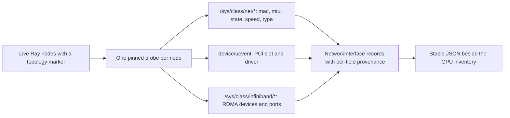

# Network interface inventory

See [current implementation, validation status, and versions](current-status.md)
for the shared support summary and evidence boundaries.

[V1.1 and V1.2 discovery](v1.2-topology-discovery.md) give the planner GPU
hardware and intra-node GPU relationships, but nothing described the network
side, so inter-node bandwidth could only be typed in by hand.
[nic_inventory.py](../topology_scheduler/nic_inventory.py) closes that gap: it
reads every interface each live Ray node exposes, so NIC facts come from the
cluster rather than from a person.

This is an inventory, never a measurement. Advertised link speed is what the
driver says the link negotiated; comparing it with real throughput is
[issue #17](https://github.com/LawrenceL05/topology-aware-gpu-scheduling/issues/17),
and using it for placement scoring is
[issue #16](https://github.com/LawrenceL05/topology-aware-gpu-scheduling/issues/16).



## What is read, and from where

| Field | Source |
| --- | --- |
| `mac` | `/sys/class/net/<name>/address` |
| `operstate` | `/sys/class/net/<name>/operstate` |
| `mtu` | `/sys/class/net/<name>/mtu` |
| `speed_mbps` | `/sys/class/net/<name>/speed` |
| `kind` | `/sys/class/net/<name>/type` plus whether a PCI function exists |
| `pci_address`, `driver` | `PCI_SLOT_NAME` and `DRIVER` in `<name>/device/uevent` |
| `numa_node` | `<name>/device/numa_node` |
| `rdma` | `/sys/class/infiniband/*`, matched to the interface by PCI address |

Reading `device/uevent` rather than following the `device` symlink keeps one
code path for a real host and for a fixture, since a fixture cannot contain
symlinks.

## Unknown is not zero

Every field is a `Reading` with a `value`, the `source` file it came from, and
a `confidence`:

| Confidence | Meaning |
| --- | --- |
| `reported` | The kernel returned a usable value |
| `unavailable` | The file does not exist for this interface |
| `unsupported` | The driver declined: `speed` of `-1`, or sysfs answering `EINVAL` |
| `unreadable` | The file exists but could not be read, such as a permission error |

So a bridge with no speed file, a NIC whose driver reports `-1`, and a link
genuinely negotiated at 0 are three different answers, and none of them is
silently a zero. A field that could not be read also appears in the interface's
`problems`, and the node keeps all of its other interfaces.

## Kinds

| Kind | Rule |
| --- | --- |
| `loopback` | ARPHRD type 772, or the name `lo` |
| `physical` | A PCI function was found in `device/uevent` |
| `virtual` | The kernel described the interface but it has no PCI function |
| `unknown` | Neither the type nor a PCI function could be read |

`up` is derived from `operstate`, so a down physical NIC is still inventoried
as physical.

## RDMA and InfiniBand

Each device under `/sys/class/infiniband/` is read for its node type, its port
states, and the link layer of its first port, then attached to the interface
that shares its PCI address. An interface with no PCI function never inherits
one. A Mellanox port therefore reports both its Ethernet identity and the
`mlx5_0` device beside it, which is what a later affinity graph needs to tell
an RDMA-capable path from a plain one.

## Run it

```bash
python -m examples.nic_inventory          # A synthetic host; runs in CI.
python -m examples.nic_inventory --host   # This machine's own interfaces.
python -m examples.nic_inventory --live   # Every live Ray node.
```

```python
import ray
from topology_scheduler import discover_nic_inventory

ray.init(address="auto")
for inventory in discover_nic_inventory():
    for interface in inventory.physical:
        print(inventory.node_name, interface.name,
              interface.speed_mbps.value, interface.speed_mbps.confidence)
```

`discover_nic_inventory()` pins one probe per live node that advertises a
`topology_node:<name>` resource and keeps the Ray node id, so its records line
up with `discover_ray_gpu_inventory()` for the same machine. Unlike GPU
discovery it does not require the node to have a GPU.

Ordering is stable: interfaces sort by name, and repeated discovery on an
unchanged host serializes identically.

## Limits

- Linux sysfs only. On other platforms the collector returns no interfaces and
  says so rather than raising.
- Advertised speed is not throughput, and this module never sends traffic.
- Virtual machines and containers often hide PCI, NUMA, or speed. Those fields
  come back `unavailable` or `unsupported`; nothing is guessed.
- Bonds, VLANs, and bridges are inventoried as virtual interfaces, without
  resolving which physical members carry them.
- No physical InfiniBand or multi-NIC host has been inventoried yet. The rules
  are covered by fixtures, and CI additionally runs the collector against a
  real Linux host that has only loopback and a virtual NIC.
