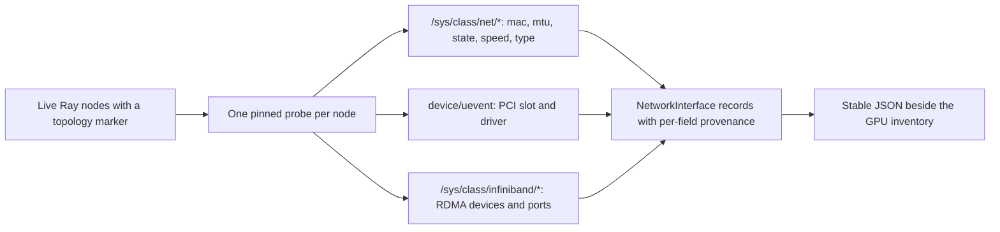

# Network interface inventory

See [current implementation, validation status, and versions](current-status.md)
for the shared support summary and evidence boundaries.

[V1.1 and V1.2 discovery](v1.2-topology-discovery.md) give the planner GPU
hardware and intra-node GPU relationships, but nothing described the network
side, so inter-node bandwidth could only be typed in by hand.
[nic_inventory.py](../topology_scheduler/nic_inventory.py) closes that gap: it
reads every interface each live Ray node exposes, so NIC facts come from the
cluster rather than from a person.

This is an inventory, never a measurement. Advertised link speed is what the
driver says the link negotiated; comparing it with real throughput is
[issue #17](https://github.com/LawrenceL05/topology-aware-gpu-scheduling/issues/17),
and representing it in a typed topology graph is
[issue #16](https://github.com/LawrenceL05/topology-aware-gpu-scheduling/issues/16).
Neither inventory nor graph relationships enforce placement or select a NIC.



## What is read, and from where

| Field | Source |
| --- | --- |
| `mac` | `/sys/class/net/<name>/address` |
| `operstate` | `/sys/class/net/<name>/operstate` |
| `mtu` | `/sys/class/net/<name>/mtu` |
| `speed_mbps` | `/sys/class/net/<name>/speed` |
| `kind` | `/sys/class/net/<name>/type`, PCI identity, and membership in `/sys/devices/virtual/net` |
| `pci_address`, `driver` | `PCI_SLOT_NAME` and `DRIVER` in `<name>/device/uevent` |
| `numa_node` | `<name>/device/numa_node` |
| `rdma` | `/sys/class/infiniband/*`, matched to the interface by PCI address |

Reading `device/uevent` lets fixtures supply the same attributes without
creating symlinks; on a real host the filesystem resolves the sysfs links.
See the [Linux sysfs documentation](https://www.kernel.org/doc/html/v6.9/filesystems/sysfs.html)
for the device tree and class links.

## Unknown is not zero

Interface scalar attributes are `Reading` values with the `source` file and
a `confidence`:

| Confidence | Meaning |
| --- | --- |
| `reported` | The kernel returned a usable value |
| `unavailable` | The file does not exist for this interface |
| `unsupported` | The driver declined: `speed` of `-1`, or sysfs answering `EINVAL` |
| `unreadable` | The file exists but could not be read, such as a permission error |

So a bridge with no speed file, a NIC whose driver reports `-1`, and a link
genuinely negotiated at 0 are three different answers, and none of them is
silently a zero. A field that could not be read also appears in the interface's
`problems`, and the node keeps all of its other interfaces.

## Kinds

| Kind | Rule |
| --- | --- |
| `loopback` | ARPHRD type 772, or the name `lo` |
| `physical` | A PCI function was found in `device/uevent` |
| `virtual` | No PCI identity was found, and the name appears under `/sys/devices/virtual/net` |
| `unknown` | None of the above has enough evidence; missing PCI alone does not imply virtual |

`up` is derived from `operstate`, so a down physical NIC is still inventoried
as physical.

Unreadable `device/uevent` preserves `unreadable` confidence on both PCI and
driver fields and adds diagnostics. An inaccessible PCI device or a non-PCI
interface such as USB remains `unknown` unless there is explicit evidence for
another kind. Here `physical` means PCI-backed as exposed by the host; a virtual
machine may expose a PCI-backed virtual adapter, so it does not prove bare-metal
hardware.

## RDMA and InfiniBand

Each device under `/sys/class/infiniband/` is read for its node type, its port
states, and the link layer of its first port, then attached to the interface
that shares its PCI address. An interface with no PCI function never inherits
one. A Mellanox port therefore reports both its Ethernet identity and the
`mlx5_0` device beside it, which is what a later affinity graph needs to tell
an RDMA-capable path from a plain one.

RDMA PCI identity, node type, link layer, and port states are also `Reading`
values with source and confidence. If an RDMA device cannot be matched because
its PCI identity is unreadable or no interface shares it, the device remains in
the node's `unattached_rdma` list and the node records a diagnostic. An
inaccessible RDMA device therefore cannot look like a host with no RDMA
hardware.

## Run it

```bash
python -m examples.nic_inventory          # A synthetic host; runs in CI.
python -m examples.nic_inventory --host   # This machine's own interfaces.
python -m examples.nic_inventory --live   # Every live Ray node.
```

```python
import ray
from topology_scheduler import discover_nic_inventory

ray.init(address="auto")
for inventory in discover_nic_inventory():
    for interface in inventory.physical:
        print(inventory.node_name, interface.name,
              interface.speed_mbps.value, interface.speed_mbps.confidence)
```

`discover_nic_inventory()` pins one probe per live node that advertises a
`topology_node:<name>` resource and keeps the Ray node id, so its records line
up with `discover_ray_gpu_inventory()` for the same machine. Unlike GPU
discovery it does not require the node to have a GPU.

All markers are validated before dispatch, and names must be unique across
live marked nodes. Probes have retries disabled. A submission error, task
failure, timeout, or interrupt cancels tasks already submitted and propagates
the error; callers can retry explicitly. Inaccessible sysfs fields are instead
returned as partial inventory with the affected values' confidence preserved.

On Linux with `.[ray]` installed, run `python -m examples.ray_nic_smoke` for two
local Ray nodes with no GPUs. It verifies node affinity, retained node identity,
and repeat serialization while reading real host sysfs. This runs in Linux CI;
both nodes share one host and it is not physical multi-node or bandwidth evidence.

Ordering is stable: interfaces sort by name, and repeated discovery on an
unchanged host serializes identically.

## Limits

- Linux sysfs only. On other platforms the collector returns no interfaces and
  says so rather than raising.
- Advertised speed is not throughput, and this module never sends traffic.
- Virtual machines and containers often hide PCI, NUMA, or speed. Those fields
  come back `unavailable` or `unsupported`; nothing is guessed.
- Bonds, VLANs, and bridges are inventoried as virtual interfaces, without
  resolving which physical members carry them.
- No physical InfiniBand or multi-NIC host has been inventoried yet. The rules
  are covered by fixtures, and CI additionally runs the collector against a
  real Linux host and tests the Ray discovery path using two nodes on that host.
