# Single-GPU validation report

This report records the first physical-GPU validation of the project. It is a
small-cluster smoke test, not a performance benchmark or evidence for
multi-GPU topology, KAI admission, or Dynamo/vLLM inference.

## Run identity

| Field | Value |
| --- | --- |
| Date | 2026-09-20 |
| Environment | UC San Diego Datahub research allocation |
| Tested commit | `a48148bf1f81a6963d843580501de390fc0282ca` |
| GPU | 1 x NVIDIA GeForce GTX 1080 Ti |
| GPU memory reported by NVML | 11.81 GB |
| NVIDIA driver | 580.126.20 |
| Driver-reported CUDA compatibility | 13.0 |
| Python | 3.11.9 |
| Ray | 2.55.0 |
| PyTorch used for the direct CUDA check | 2.2.1+cu121 |

The project was installed in a fresh virtual environment with:

```bash
python -m venv .venv
.venv/bin/python -m pip install -e '.[ray]'
```

## Validation workflow

The checks were run in this order so that each layer was verified before the
next layer depended on it:

```mermaid
flowchart LR
    H[Inspect physical GPU] --> U[Run unit tests]
    U --> I[Discover GPU through Ray and NVML]
    I --> P[Reserve one GPU worker]
    P --> O[Reject a two-worker request]
    O --> B[Exercise five baseline policies]
    B --> K[Run KAI contract tests]
    K --> D[Run Dynamo contract tests]
    D --> C[Run direct CUDA computation]
    C --> M[Check documentation]
```



### 1. Hardware and CUDA visibility

`nvidia-smi` reported one GTX 1080 Ti. The base Python environment reported
`torch.cuda.is_available() == True`, one CUDA device, and the same model name.

### 2. Regression suite

```bash
.venv/bin/python -m unittest discover -s tests -v
```

Result: 78 tests passed in 7.838 seconds.

### 3. Physical inventory through Ray

A local Ray runtime advertised one physical GPU and one node marker:

```python
ray.init(
    num_cpus=2,
    num_gpus=1,
    resources={"topology_node:local": 1},
    include_dashboard=False,
)
inventory = discover_ray_gpu_inventory()
```

The collector returned one GTX 1080 Ti with 11.81 GB, its NVML UUID and PCI bus
identity, and an empty connection list. An empty list is correct for a node
with only one GPU; this run does not validate pairwise PCI, NUMA, or NVLink
relationships.

### 4. Ray placement and capacity rejection

A one-worker plan completed and the task reported `ray.get_gpu_ids() == [0]`
and `CUDA_VISIBLE_DEVICES=0`. A two-worker plan on the same runtime failed
before reservation with:

```text
ValueError: Insufficient total resources on topology_node:local
```

This validates single-GPU resource assignment and oversubscription rejection.
The Ray task itself did not run a CUDA model or benchmark.

### 5. Reference policies

The `gpu_count`, `accelerator_type`, `workload_compute`, `topology_only`, and
`combined` policies were each given the same one-node, one-worker input. Every
policy selected `local`. The topology-only estimate was zero because one
worker creates no communication pair.

### 6. Backend contract suites

```bash
.venv/bin/python -m unittest tests.test_kai_backend -v
.venv/bin/python -m unittest tests.test_dynamo_contract \
  tests.test_dynamo_contract_binding tests.test_dynamo_backend \
  tests.test_dynamo_guardian -v
```

Results: 13 KAI tests and 30 Dynamo contract/lifecycle tests passed. These are
mocked or CPU/fake-engine tests. They do not prove live KAI scheduling or real
Dynamo/vLLM inference.

### 7. Direct CUDA smoke

The base PyTorch environment created a `1024 x 1024` tensor on the GPU,
multiplied it by itself, synchronized CUDA, and confirmed every output value
was finite. This proves CUDA computation was available on the allocated GPU;
it is not a throughput or latency measurement.

### 8. Documentation validation

```bash
.venv/bin/python scripts/check_docs.py
```

Result: all 15 Markdown files passed the documentation checks at the tested
commit.

## Remaining validation

This run cannot validate GPU-to-GPU topology, a successful multi-worker or
multi-node placement, GPU-to-NIC affinity, inter-node measurements, KAI gang
scheduling, or the two-replica Dynamo V1 runtime. Those paths need at least two
GPUs, and the network paths need at least two nodes. No JCT, utilization, or
policy-improvement claim should be derived from this smoke test.
