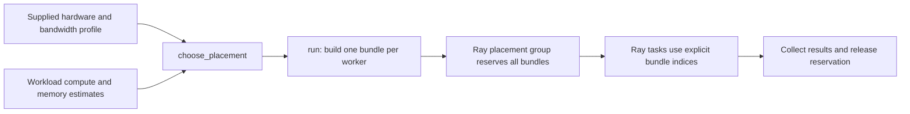

# Ray integration and source guide

See [current implementation, validation status, and versions](current-status.md)
for the shared support summary and evidence boundaries.

## Full Ray source

Browse **[all Ray source code](https://github.com/ray-project/ray)**, or the
**[Ray 2.55.0 source tree](https://github.com/ray-project/ray/tree/ray-2.55.0)**
used by this prototype. To obtain the entire source locally:

```bash
git clone --branch ray-2.55.0 --depth 1 https://github.com/ray-project/ray.git
```

The clone includes that release's complete tracked source, but not its full Git
history. Omit `--depth 1` for history. This project links upstream and installs
Ray as a dependency; it does not duplicate Ray's source or claim authorship of
it. Ray is licensed under [Apache 2.0](https://github.com/ray-project/ray/blob/ray-2.55.0/LICENSE).
The version pin makes the prototype reproducible; it is not a claim that 2.55.0
is the latest release. Upgrade only after rerunning the integration tests.

## Where our code connects

| Component | Source | Role |
| --- | --- | --- |
| Placement policy | [policy.py](../topology_scheduler/policy.py) | Filters incompatible hardware and scores allocations of one GPU per worker. |
| Execution adapter | [ray_backend.py](../topology_scheduler/ray_backend.py) | Validates node markers, reserves bundles, launches tasks and cleans up. |
| Device identity binding | [device_binding.py](../topology_scheduler/device_binding.py) | Reserves one custom resource per physical GPU, resolves the device each rank received to its UUID, and refuses a rank that did not get the planned one. |
| V1.2 inventory | [inventory.py](../topology_scheduler/inventory.py) | Pins a probe to every live Ray GPU node and reads NVIDIA devices and their pairwise relationships through NVML. |
| Ray placement-group API | [placement_group.py](https://github.com/ray-project/ray/blob/ray-2.55.0/python/ray/util/placement_group.py) | Creates, waits for and removes resource reservations. |
| Ray scheduling options | [scheduling_strategies.py](https://github.com/ray-project/ray/blob/ray-2.55.0/python/ray/util/scheduling_strategies.py) | `PlacementGroupSchedulingStrategy` binds each task to its reserved bundle. |
| Ray cluster placement scheduler | [gcs_placement_group_scheduler.cc](https://github.com/ray-project/ray/blob/ray-2.55.0/src/ray/gcs/gcs_server/gcs_placement_group_scheduler.cc) | Coordinates placement-group resource reservation across nodes. |
| Ray node scheduling internals | [raylet scheduling directory](https://github.com/ray-project/ray/tree/ray-2.55.0/src/ray/raylet/scheduling) | Resource accounting and scheduling policies below the Python API. |
| Ray Python runtime and libraries | [python/ray](https://github.com/ray-project/ray/tree/ray-2.55.0/python/ray) | Core APIs and higher-level libraries such as Train, Tune, Serve and Data. |
| Ray C++ runtime | [src/ray](https://github.com/ray-project/ray/tree/ray-2.55.0/src/ray) | Distributed runtime implementation. |

Read our policy and adapter first, then the two Python APIs, then the C++
placement scheduler. Ray's other libraries are available through the full source
tree; this prototype does not integrate each library individually.



The planner is ordinary Python above Ray's scheduler, not a modification of
Ray's C++ scheduler. Ray remains responsible for enforcing logical CPU/GPU
allocations. Each selected node must advertise a unique custom resource such as
`topology_node:a`; that constraint pins its bundles to that node. `PACK` is only
a packing preference within those hard constraints. The adapter consumes the
marker in both the bundle and the task, and uses an explicit bundle index.
See Ray's [placement groups](https://docs.ray.io/en/releases-2.55.0/ray-core/scheduling/placement-group.html)
and [logical resources](https://docs.ray.io/en/releases-2.55.0/ray-core/scheduling/resources.html).

## Automatic GPU inventory in V1.1

V1.0 required callers to construct every `Node` with a manually entered GPU
model, GPU count and memory size. V1.1 adds `discover_ray_gpu_inventory()` and
`discover_planner_nodes()`. The collector reads live nodes from `ray.nodes()`,
pins a zero-CPU probe task to each GPU node using
`NodeAffinitySchedulingStrategy`, and uses Ray's bundled NVIDIA NVML bindings on
that node.

For every physical GPU it records the device index, UUID, full name, the
accelerator type parsed by Ray, decimal GB of total memory, and PCI bus ID. The
Ray node ID and its unique `topology_node:<name>` marker are retained. The
planner conversion uses Ray's configured logical `GPU` quantity as capacity;
NVML's physical device count is a consistency check.

```python
import ray
from topology_scheduler import discover_planner_nodes

ray.init(address="auto")
nodes = discover_planner_nodes(timeout=30)
```

V1.1 does not use current free VRAM as `available_gpus`. Free VRAM is a changing
observation and does not reserve a device. Ray's placement group remains the
atomic capacity claim. The collector rejects mixed GPU models, non-uniform
memory, fractional configured GPU capacity, missing node markers, and cases
where Ray advertises more GPUs than NVML sees. These restrictions keep the
automatically generated data faithful to the existing one-model-per-node
`Node` schema.

V1.2 extends the same probe with a complete undirected graph for the GPUs on
each node. Every pair records its closest shared PCI/NUMA ancestor and the
number of active direct NVLinks whose remote PCI identity is the other GPU.
See [V1.2 topology discovery](v1.2-topology-discovery.md) for field semantics
and limitations.

The collector obtains hardware topology only. Workload compute measurements,
memory requirements, communication volume, and inter-node link bandwidth are
still inputs to the experiment.

## Cost model

For a fixed number of equal-sized ranks, the score in seconds is:

```text
max(compute_seconds_by_gpu[rank.gpu_model])
  + sum(cross_node_gb_per_pair / link_bandwidth_GB_per_second)
```

The sum includes every unordered worker pair on different nodes. This is a
simple serialized pair-traffic surrogate, not an NCCL collective simulator or
a measured JCT prediction. Compute estimates must describe this workload at
the requested worker count and include local communication. Supply measured
profiles for meaningful decisions. GB and GB/s are decimal units; the argument
`bandwidth_gbps` means gigabytes per second, not gigabits per second.

The planner excludes nodes with insufficient per-GPU memory, zero available
GPUs or an unknown GPU model. It rejects missing links when communication is
required. Equal scores use node-name ordering for reproducibility. The search
is exhaustive and capped at 100,000 candidate multisets; it is intended for
small research clusters. It has no queue model, fairness, preemption or
large-cluster search heuristic yet.

## Run locally without physical GPUs

From the repository root, using Python 3.10 or newer (3.12 is used in CI):

```bash
python -m pip install -e '.[ray]'
python -m examples.plan
python -m unittest discover -s tests -v
python -m examples.ray_smoke
python -m examples.ray_multinode_smoke
```

`examples.plan` uses synthetic costs. `examples.ray_smoke` starts a real local
Ray runtime advertising **two simulated logical GPUs** and checks that two
tasks receive distinct GPU IDs on the selected node. It does not execute CUDA,
load a model or demonstrate GPU performance. Only use artificial GPU counts
for this smoke test.

The multi-node example uses Ray's test-cluster utility to start two local nodes
and verifies their node IDs match the planned assignments. This tests node
constraints, not a physical network or a multi-machine GPU deployment.

## Run on a real cluster

Install this package with the Ray extra on every node and the driver. On two
Linux machines that each actually have two usable GPUs and at least two CPUs:

```bash
# Head machine a; use its reachable private address for HEAD_IP below.
ray start --head --port=6379 --num-gpus=2 --resources='{"topology_node:a": 2}'
# Worker machine b:
ray start --address=HEAD_IP:6379 --num-gpus=2 --resources='{"topology_node:b": 2}'
```

Each marker must exist on exactly one live node, with one unit per usable GPU.
Inventory assumes a single GPU model and uniform memory per node. Do not label
a node as H100 or B200 unless that matches its hardware. The following driver
is an example using illustrative inventory and timing inputs; replace those
values with your own measurements:

```python
import ray
from topology_scheduler import Node, Workload, choose_placement
from topology_scheduler.ray_backend import run

def worker(rank):
    import ray
    # Replace with application work. Ray sets CUDA_VISIBLE_DEVICES.
    return {"rank": rank, "gpu_ids": ray.get_gpu_ids()}

ray.init(address="auto")
try:
    plan = choose_placement(
        [Node("a", "H100", 2, 80), Node("b", "B200", 2, 180)],
        Workload(2, 40, {"H100": 10, "B200": 7}, 20),
        {("a", "b"): 25},
    )
    print(run(plan, worker, reservation_timeout=60, execution_timeout=300))
finally:
    ray.shutdown()  # Disconnects this driver from the existing cluster.
```

The supplied `available_gpus` is a planning snapshot, not a live atomic claim.
`ray.nodes()` checks total configured capacity and marker uniqueness; it does
not provide authoritative per-node free capacity here. Ray's placement group
is the actual reservation. If another job consumes capacity, the reservation
can wait and time out. The adapter releases the group after success, timeout
or task failure and cancels outstanding tasks. Removal is asynchronous. Refresh
inventory and explicitly replan if needed; there is no silent fallback to a
different placement. Driver disconnect is separate from shutting down cluster
nodes.

## Scope and next experiments

This is a functional task-placement prototype, not a complete distributed LLM
inference service. Each task requests one CPU and one GPU. Ray assigns the
physical GPU IDs; a rank can now verify which device it received and refuse a
mismatch through [device identity binding](device-binding.md), but the policy
still cannot select a particular NVLink pair within a node. The cost model
still models inter-node links only. GPU memory is a supplied feasibility
estimate, not an enforced memory reservation.

For tensor-parallel inference, add model loading, rank rendezvous, collective
communication and engine lifecycle handling in an appropriate worker/actor
layer. The [V1 Dynamo contract](dynamo-v1-contract.md) fixes that layer's first
runtime and ownership boundary; the [lifecycle adapter](dynamo-lifecycle.md)
implements independent TP=1 replicas with CPU/fake-engine coverage. Real
Dynamo/GPU serving remains unverified.
No H100/B200 cluster experiment or improvement claim is included. Compare
policies on matched traces and real hardware; report queue
wait and execution boundaries, failures, utilization, and the chosen normalized
JCT denominator separately from this placement score.
