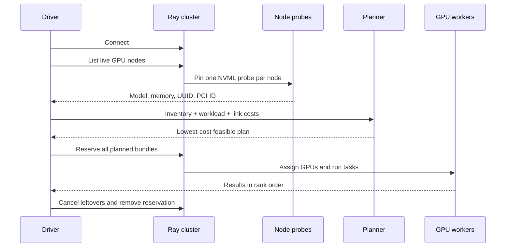

# V1.1 workflow

See [current implementation, validation status, and versions](current-status.md)
for the shared support summary and evidence boundaries.

V1.1 discovers GPU hardware on the Ray cluster, converts it into planner input,
chooses a node placement, and asks Ray to reserve and execute that plan.



## 1. Start and label the cluster

Each GPU node advertises its logical GPU count and one unique node marker. For
example:

```bash
# Node a
ray start --head --port=6379 --num-gpus=2 \
  --resources='{"topology_node:a": 2}'

# Node b
ray start --address=HEAD_IP:6379 --num-gpus=2 \
  --resources='{"topology_node:b": 2}'
```

The marker lets the execution adapter turn a planner choice such as node `a`
into a hard Ray resource constraint.

## 2. Discover the GPUs

The driver connects and requests planner-ready inventory:

```python
import ray
from topology_scheduler import discover_planner_nodes

ray.init(address="auto")
nodes = discover_planner_nodes(timeout=30)
```

`discover_planner_nodes()` first calls `ray.nodes()`. It launches a zero-CPU
probe on every live node with a positive `GPU` resource and pins the probe with
Ray's `NodeAffinitySchedulingStrategy`.

On each node, Ray's bundled NVIDIA NVML bindings read every visible GPU's name,
UUID, total memory, and PCI bus ID. The collector uses Ray's configured logical
GPU count as schedulable capacity. Current free VRAM is not capacity because
observing memory does not reserve it.

The current planner represents one GPU model and memory size per node, so V1.1
rejects mixed models, non-uniform memory, missing node markers, fractional GPU
capacity, and a logical GPU count larger than the NVML device count.

## 3. Describe the workload

Hardware discovery cannot determine how fast a model runs or how much traffic
its workers exchange. Those measured properties remain explicit:

```python
from topology_scheduler import Workload

workload = Workload(
    workers=2,
    memory_gb_per_worker=40,
    compute_seconds_by_gpu={"H100": 10, "B200": 7},
    cross_node_gb_per_pair=20,
)
links = {("a", "b"): 25}  # GB/s
```

## 4. Choose a placement

```python
from topology_scheduler import choose_placement

plan = choose_placement(nodes, workload, links)
```

The planner removes incompatible nodes, enumerates allocations within each
node's GPU capacity, and minimizes:

```text
slowest selected GPU compute time
  + sum(cross-node traffic / link bandwidth)
```

This score compares candidate placements. It is not a measured JCT or a full
collective-communication simulation.

## 5. Reserve and execute

```python
from topology_scheduler.ray_backend import run

results = run(plan, worker)
```

The adapter revalidates the selected node markers, creates one placement-group
bundle per worker, and waits for Ray to reserve every bundle atomically. A
typical bundle is:

```python
{"CPU": 1, "GPU": 1, "topology_node:a": 1}
```

Each worker is bound to its bundle index. Ray chooses the physical GPU, reports
it through `ray.get_gpu_ids()`, and limits visibility with
`CUDA_VISIBLE_DEVICES`. Results are returned in rank order.

For a plan that also names GPU UUIDs, the optional
[`run_with_devices()` adapter](device-binding.md) checks each rank before its
workload starts. It queries the CUDA-visible UUID and compares it with the
NVML candidate for Ray's assignment and the requested UUID. Missing identity
or a mismatch refuses that rank; `CUDA_DEVICE_ORDER=PCI_BUS_ID` alone is not
identity evidence. UUID resource tokens do not select physical devices, and
this check does not provide an all-rank startup barrier. The ordinary `run()`
workflow above continues to leave device selection to Ray.

## 6. Clean up

Whether execution succeeds, times out, or raises an error, the adapter attempts
to cancel outstanding tasks and remove the placement group. Finally,
`ray.shutdown()` disconnects the driver; it does not stop cluster nodes started
with `ray start`.

## Complete driver

```python
import ray
from topology_scheduler import Workload, choose_placement, discover_planner_nodes
from topology_scheduler.ray_backend import run


def worker(rank):
    import ray
    return {"rank": rank, "gpu_ids": ray.get_gpu_ids()}


ray.init(address="auto")
try:
    nodes = discover_planner_nodes()
    workload = Workload(2, 40, {"H100": 10, "B200": 7}, 20)
    plan = choose_placement(nodes, workload, {("a", "b"): 25})
    print(run(plan, worker))
finally:
    ray.shutdown()
```

Run `python -m examples.ray_inventory` to inspect discovered hardware. The
existing `ray_smoke` examples use simulated logical GPUs and do not validate
NVML discovery, CUDA computation, or model performance.

## Single-GPU validation workflow

When only one physical GPU is available, validate the implementation in this
order:

1. Confirm the driver and CUDA runtime see exactly one GPU.
2. Run the complete unit suite before starting Ray.
3. Start Ray with one `GPU` and one `topology_node:<name>` resource.
4. Run `discover_ray_gpu_inventory()` and compare its model and memory with
   `nvidia-smi`.
5. Execute one worker and verify both `ray.get_gpu_ids()` and
   `CUDA_VISIBLE_DEVICES` identify the assigned device.
6. Request two workers and verify the backend rejects insufficient capacity
   before creating a placement group.
7. Run the five reference policies with one worker. They should select the only
   feasible node; topology communication cost should be zero.
8. Run the backend contract suites, a small direct CUDA calculation, and the
   documentation checker.

The [2026-09-20 single-GPU validation report](one-gpu-validation.md) records an
execution of this workflow on a GTX 1080 Ti. It does not replace the multi-GPU
and multi-node procedures: one GPU has no pairwise topology edge and cannot run
the two-replica Dynamo V1 plan.
