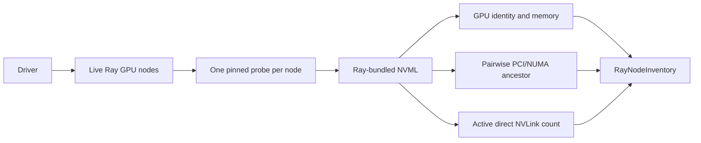

# V1.2 topology discovery

See [current implementation, validation status, and versions](current-status.md)
for the shared support summary and evidence boundaries.

V1.2 extends the V1.1 GPU inventory with a relationship graph for every GPU
pair on each Ray node. The values come from NVML on the node; callers do not
enter them manually.



## Data model

`RayNodeInventory.devices` contains each GPU's local NVML index, UUID, model,
Ray accelerator type, total memory, and PCI bus ID. `connections` contains one
undirected `GPUConnection` for every unordered device pair:

```python
GPUConnection(
    source_uuid="GPU-...",
    target_uuid="GPU-...",
    common_ancestor="single-pci-bridge",
    direct_nvlink_count=2,
)
```

`common_ancestor` normalizes NVML's topology level as `internal`,
`single-pci-bridge`, `multiple-pci-bridges`, `host-bridge`, `numa-node`, or
`system`. An unrecognized future NVML value is preserved as `unknown-<value>`.

`direct_nvlink_count` inspects active links from both GPUs and counts links whose
remote PCI bus ID matches the other endpoint. Parallel NVLinks therefore
produce values larger than one. If both endpoints return counts, they must
agree. This is a link count, not measured bandwidth.

If NVML cannot answer a pairwise ancestry or NVLink query, the corresponding
field is `None`. A zero direct-link count specifically means NVML answered the
queries and found no direct links between the pair.

## Run it

Start the Ray cluster with one unique `topology_node:<name>` resource on each
GPU node, then run:

```bash
python -m examples.ray_inventory
```

The example connects with `ray.init(address="auto")` and prints each inventory
as a dictionary, including `devices` and `connections`.

## Current boundary

`discover_planner_nodes()` still converts each inventory to the V1 node-level
planner schema. It uses discovered model, memory, and Ray's configured logical
GPU capacity. It does not feed individual `GPUConnection` edges into the cost
score yet.

Ray's task resource request selects a logical GPU on a chosen node. The current
adapter cannot request a specific physical GPU UUID or require a particular
NVLink edge. Using this graph to score or enforce device-level placement would
therefore overstate what the execution layer guarantees. V1.2 exposes the
measured graph first so later work can add an enforceable UUID mapping.

This collector covers intra-node GPU relationships. Network interfaces are
collected separately by the [NIC inventory](nic-inventory.md), which records
each interface's PCI function, NUMA node, driver, state, and advertised speed.
GPU-to-NIC affinity is not derived here. Inter-node TCP bandwidth and latency
are measured separately and only on request; see
[inter-node link measurement](link-measurement.md). Advertised speed remains
separate from measured throughput.

## Dependency boundary

The implementation imports `ray._private.thirdparty.pynvml` only inside the
remote node probe. This is Ray 2.55.0's bundled private NVML binding. Keeping
that import isolated makes a future move to a supported NVML package local to
the probe instead of spreading the private dependency across the public API.
