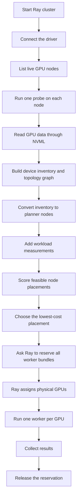

# V1.2 workflow

See [current implementation, validation status, and versions](current-status.md)
for the shared support summary. V1.2 is a design milestone, not a package
release. This workflow covers the Ray finite-task adapter; persistent model
serving uses the separate [Dynamo lifecycle](dynamo-lifecycle.md).

V1.2 discovers the GPUs and their relationships, chooses a node placement,
and asks Ray to reserve and run it.



## 1. Start the Ray cluster

Each machine starts a Ray node and advertises its GPU count, CPU count, and one
unique marker such as `topology_node:a`. The marker lets the execution adapter
request that machine later. Advertise at least one marker unit and one CPU
per concurrently scheduled GPU worker; a marker capacity of one cannot host
two worker bundles. See the [cluster startup example](v1.1-workflow.md).

## 2. Discover the hardware

The driver connects with `ray.init(address="auto")` and calls
`discover_ray_gpu_inventory()`. The function lists live Ray GPU nodes and pins
one small probe task to each node.

Each probe uses Ray's bundled NVML binding to read, rather than user input:

- GPU index, UUID, model, accelerator type, total memory, and PCI bus ID;
- the closest PCI or NUMA ancestor for every GPU pair;
- the number of active direct NVLinks for every GPU pair.

The driver combines these results into one `RayNodeInventory` per node. Its
`devices` field contains the GPUs and its `connections` field is the pairwise
relationship graph. If NVML cannot report a relationship, that field is
`None`; zero means NVML checked and found no direct link.

Run the inventory view on a configured GPU cluster with:

```bash
python -m examples.ray_inventory
```

## 3. Prepare the planner input

`discover_planner_nodes()` converts the full inventory into the current
node-level planner format. It uses the discovered GPU model and memory together
with Ray's configured logical GPU capacity. This is total configured capacity,
not currently free GPUs or free VRAM; Ray checks resource availability when
reserving the plan. Conversion rejects mixed GPU models and incompatible
memory sizes within one node.

The experiment still supplies information that hardware discovery cannot know:

- workers and memory required by the workload;
- measured compute time for each GPU model;
- expected cross-node traffic;
- measured inter-node bandwidth in GB/s, keyed by sorted node-name pairs.

The separate [NIC inventory](nic-inventory.md) reports advertised link speed,
not measured throughput. It does not automatically populate planner bandwidth.

## 4. Choose the placement

With its default `combined` policy, `choose_placement()` removes incompatible nodes, enumerates feasible worker
allocations, and selects the lowest estimated cost:

```text
slowest selected GPU compute time
  + estimated cross-node communication time
```

This score compares placements. It is not a measured job completion time or a
full communication simulation. Other [baseline policies](baseline-policies.md)
use different selection rules; none consumes the physical GPU graph today.

## 5. Reserve and run

The Ray adapter creates one placement-group bundle per worker. Each bundle asks
for one CPU, one GPU, and the selected node marker:

```python
{"CPU": 1, "GPU": 1, "topology_node:a": 1}
```

Ray reserves all bundles together. It then places one worker in each bundle,
assigns the physical GPU, and sets `CUDA_VISIBLE_DEVICES` for that worker.

## 6. Return results and clean up

The adapter returns results in worker-rank order. On success, timeout, or worker
failure, it cancels unfinished tasks and removes the placement group so Ray can
reuse the resources.

## What is automatic

| Read by the code | Supplied by the experiment |
| --- | --- |
| GPU model and accelerator type | Workload compute times |
| GPU count and total memory | Workload memory requirement |
| GPU UUID and PCI bus ID | Communication volume |
| PCI/NUMA relationship | Inter-node bandwidth |
| Direct NVLink count | |

## Current limit

V1.2 discovers the physical GPU graph, but the current planner selects nodes
and Ray selects the physical GPU inside each node. The scheduler therefore
cannot yet guarantee that workers receive a particular NVLink-connected GPU
pair. The graph is collected for inspection and later policy work; it does not
change the placement score in V1.2.

The [single-GPU validation report](one-gpu-validation.md) verifies physical
inventory and Ray assignment on one GPU. Pair topology and multi-GPU device
selection remain unverified; simulated examples do not establish those claims.

See [V1.2 topology discovery](v1.2-topology-discovery.md) for the exact fields,
NVML behavior, and the boundary needed before device-level scoring is safe.
